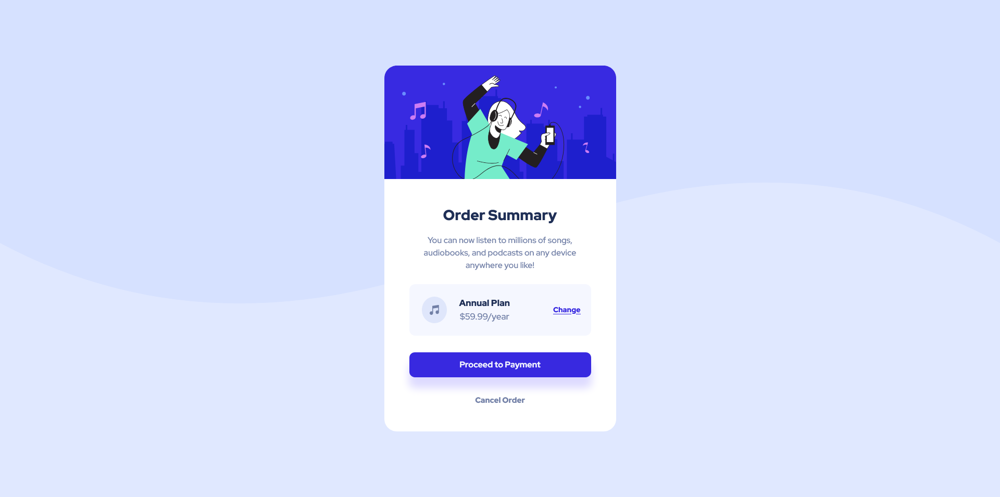

# Frontend Mentor - Order summary card solution

This is a solution to the [Order summary card challenge on Frontend Mentor](https://www.frontendmentor.io/challenges/order-summary-component-QlPmajDUj). Frontend Mentor challenges help you improve your coding skills by building realistic projects. 

## Table of contents

- [Overview](#overview)
  - [The challenge](#the-challenge)
  - [Screenshot](#screenshot)
  - [Links](#links)
- [My process](#my-process)
  - [Built with](#built-with)
  - [What I learned](#what-i-learned)
  - [Continued development](#continued-development)
  - [Useful resources](#useful-resources)
- [Author](#author)

## Overview

### The challenge

Users should be able to:

- See hover states for interactive elements

### Screenshot




### Links

- Solution URL: [Github](https://github.com/MikeBeloborodov/Order_summary_component)
- Live Site URL: [Netlify](https://marvelous-baklava-bbf272.netlify.app/)

## My process

### Built with

- Semantic HTML5 markup
- CSS custom properties
- Flexbox
- CSS Grid
- Mobile-first workflow

### What I learned

I've learned a little bit about shadows, cursor styles:

```css
.order__payment {
    box-shadow: 0 20px 15px 1px hwb(245 86% 0%);
    cursor: pointer;
}
```

Had some work with background images, learned how to fit and stretch them:

```css
body {
    background-image: url(images/pattern-background-mobile.svg);
    background-repeat: no-repeat;
    background-size: contain;
}
```

Learned how to stretch a button to the full width of a container:

```css
.order__payment {
    display: block;
    border-style: none;
    width: 100%;
}
```

### Continued development

Need more general practice with html selectors and css flexbox, grid.

## Author

- Github - [Mike Beloborodov](https://github.com/MikeBeloborodov)
- Frontend Mentor - [@MikeBeloborodov](https://www.frontendmentor.io/profile/MikeBeloborodov)